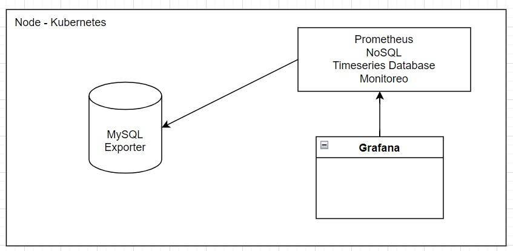
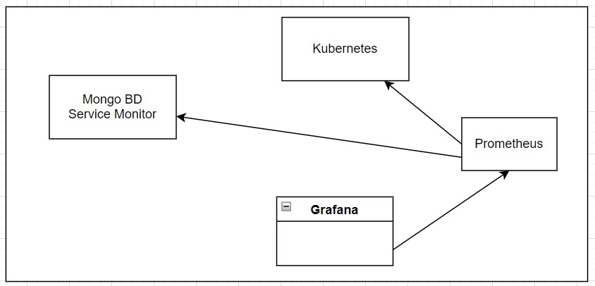

# Apuntes Viernes 26 de Agosto

## Estudiante: Celina Madrigal Murillo - 2020059364

**Métricas:** información de como funciona un computador o un servicio.

**Prometheus:** Base de datos NoSQL.

**Timeseries Database**: sistemas que generan cantidades masivas de datos en muy poco tiempo.

**Scrapper:** ir a recoger datos.

**Grafana:** tool para hacer analytics.

**Exporter:** Expone las métricas de utilización.

**Servicemonitor:** Solicita monitoreo a Kubernetes, se puede conectar a cualquier servicio.

**Postgres:** se instala en Kubernetes por medio de helm, existe documentacion en github.

**Grafana Dashboards:** Ofrece Dashboards open source para DB

- Se dejó la primera prueba corta para entregar ese mismo viernes (26 de agosto) antes de la media noche.
- Se dejó la primera tarea corta para entregar el 9 de septiembre antes de las 11:30 pm.