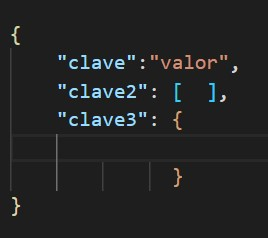

## Apuntes Viernes 9 de septiembre                 

## Estudiante: Celina Madrigal Murillo - 2020059364

## **Mongo DB**

Cuando apareció JAVA todo cambio ya que los lenguajes de programación fueron pensados para almacenar datos dentro de una PC, pero no pensados para comunicación entre ellas porque no era un requerimiento. En el momento que ya se necesitó se comenzó a tener sneaker networks. Se escribían en el mismo storage código compilado e información, lo que se definia como un struct, que sería una porción de memoria y se guardaba el espacio completo total de ese struct y un puntero apuntando a esa dirección de memoria + el desplazamiento de ese struct. Al verlos de esta manera, los datos no van a llevar un overhead.

Habían varios problemas:

- Las computadoras no tenían siempre el mismo tamaño de los datos.
- Versiones no compatibles
- Forma de organización de los datos diferentes.
- Sistemas Operativos
- Formato de datos

**Serializar:** Anotar las características de una clase y decirle al serializador que convierta los datos entre formatos.

**XML:** Extensión completamente orientada a objetos de HTML.

Luego de eso se vio el nacimiento de JavaScript que trajo consigo que el browser ejecutara código de JS para alivianar el peso del server. El problema que tiene Java es que es interpretado y compilado en bytecode y pensado en el proceso del server, es por eso que salió JS.

La informacion por http debe ser texto de caracteres ASCII.

 

### **JSON (JavaScript Object Notation)**

Comienza y termina con llaves { }. Se pueden definir tipos de datos (str, int, bool, list). Se pueden poner JSON dentro de otros JSON.

Con JSON se pueden enviar cualquier tipo de datos, como videos, audios, imágenes, entre otros, pues existe un convertirdor de binario a texto, por lo que lo puedo convertir a un str.

Mongo implementó el Document Model el cual guarda todos los documentos en JSON. Mongo lo que hace es cambiar el nombre de las tablas y les pone Collections. Estos pueden guardar cualquier tipo de 
datos y cualquier cantidad de campos. Los datos se guardan y envían en JSON.

**Collections:**
- Any kind of data
- Add fields
- Schema (diccionario de bases de datos, son dinamicos)

**Blob:** es un objeto muy grande, como multimedia.

No tiene sentido guardar un video en una base de datos porque la gracia de buscar cosas en una base de datos es indexarlos para generar rápidas respuestas. Lo que se hace es que se tiene un storage llamado Content Delivery Network. Lo que genera es un URL que se guardan como atributos.

**Ofuscamiento de datos:** Desordena los datos.  

**Encripcion de datos:** Se tiene una clave que desordena la info, esto basado en cada clave, es por eso que es diferente al ofuscamiento.  

**PKI ():** Se generan dos claves numéricas, 1 privada y otra pública. Los datos no se 
pueden desencriptar con la llave publica, solo con la privada.

 

**Sparce column:** Se usa para evitar el desperdicio de datos.

**Protocol Buffers:** Lenguaje de comunicación binario, pero ambos lados deben saber la 
estructura de los datos.

 

 

Se dejó la segunda prueba corta para entregar ese mismo viernes (9 de septiembre) antes de las 10 de la noche.
