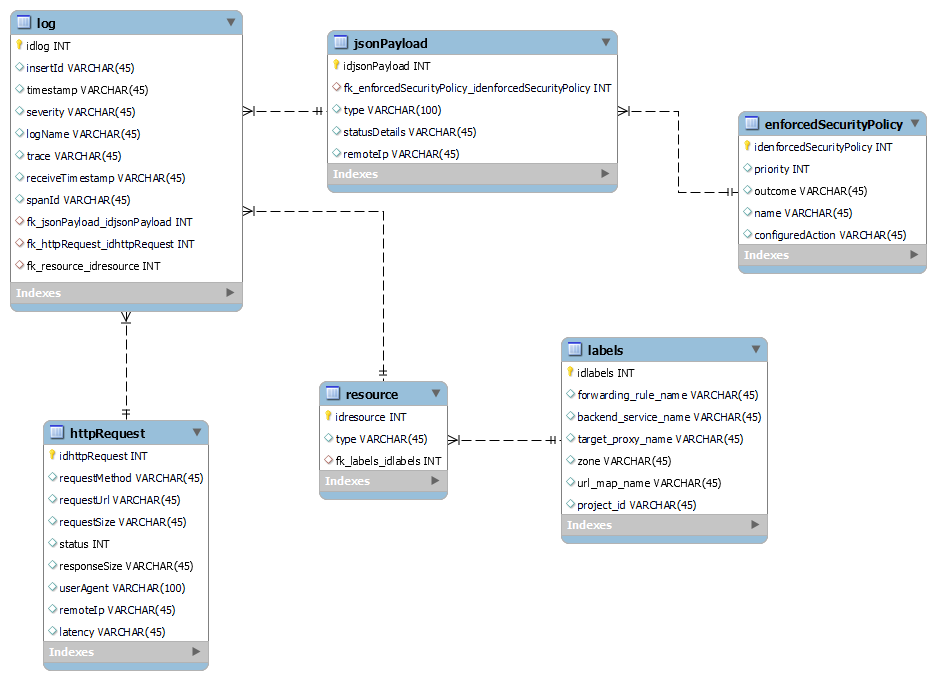

**Prueba Corta #7 y 8**  
Estudiante: Celina Madrigal Murillo  
Carné: 2020059364
  
1. Realice un modelo entidad relación normalizado hasta mínimo BCNF (Forma Normal de Boyce-Codd) de la siguiente información de logs almacenada por un balanceador de carga en la plataforma GCP:
     

    

‌
‌
‌

‌

‌

‌